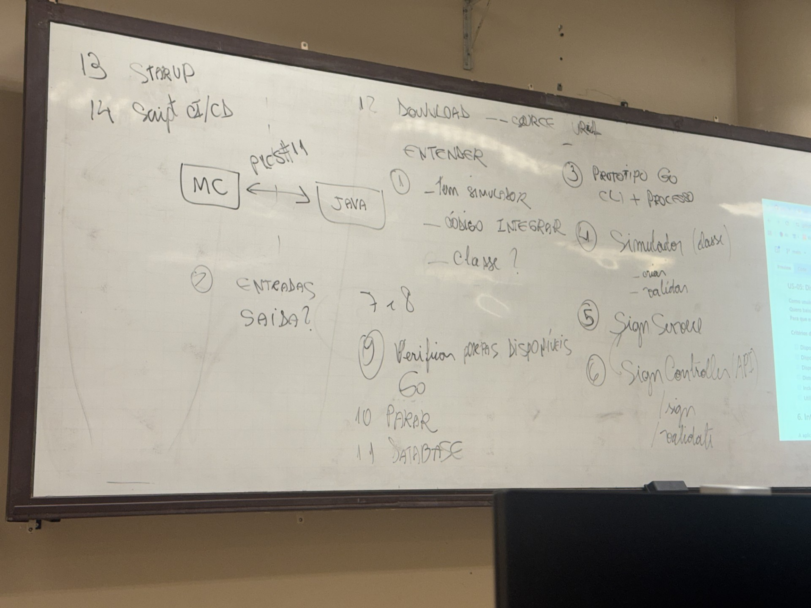

# Transcrição da Imagem de Implementação
*(Referente ao arquivo `implementacao.png`)*

## Diagrama Principal
`[ MC ] <--- PICS#11 ---> [ JAVA ]`

## Lista de Tarefas / Passos

1. **ENTENDER**
   - Tem simulador
   - CÓDIGO INTEGRAR
   - classe ?
2. **ENTRADAS / SAÍDA?**
3. **PROTÓTIPO GO**
   - CLI + PROCESSO
4. **Simulador (classe)**
   - criar
   - validar
5. **Sign Service**
6. **Sign Controller (API)**
   - `/sign`
   - `/validate`
7 e 8. *(Apenas números no quadro)*
9. **Verificar portas disponíveis GO**
10. **PARAR**
11. **DATABASE**
12. **DOWNLOAD -- SOURCE URL**
13. **STARTUP**
14. **Script CI/CD**
